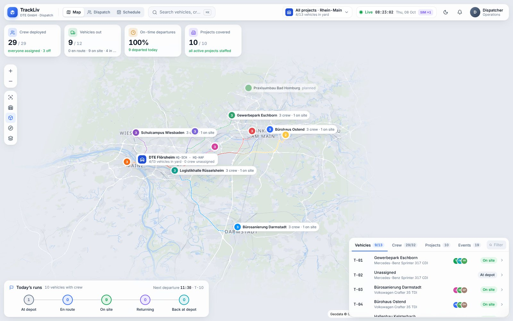
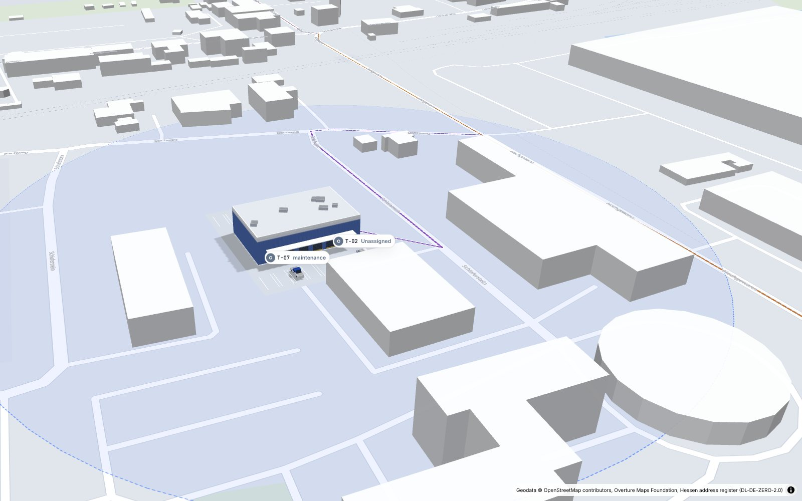
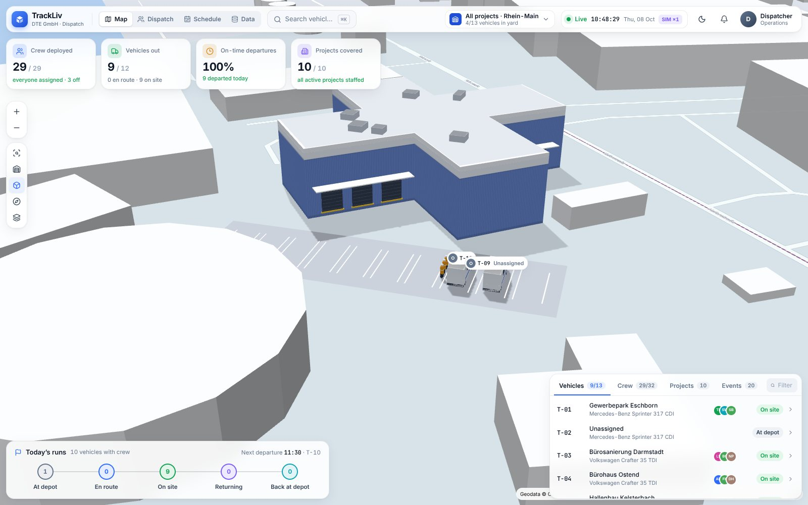
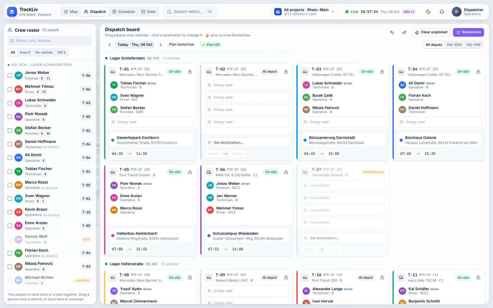
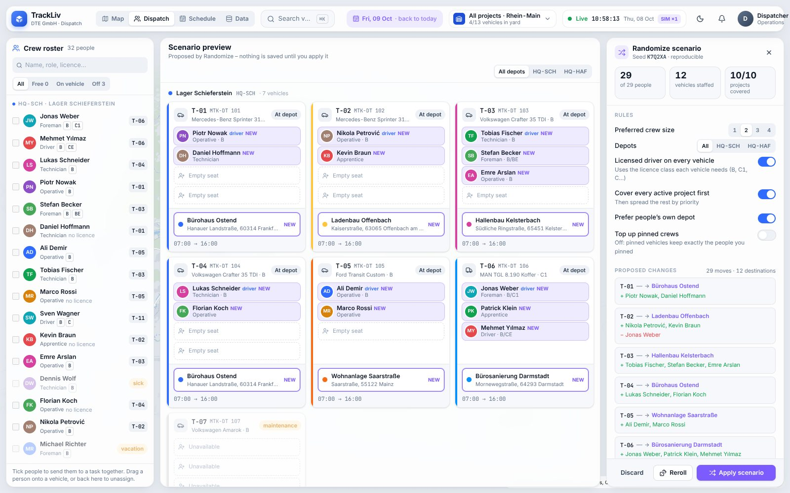
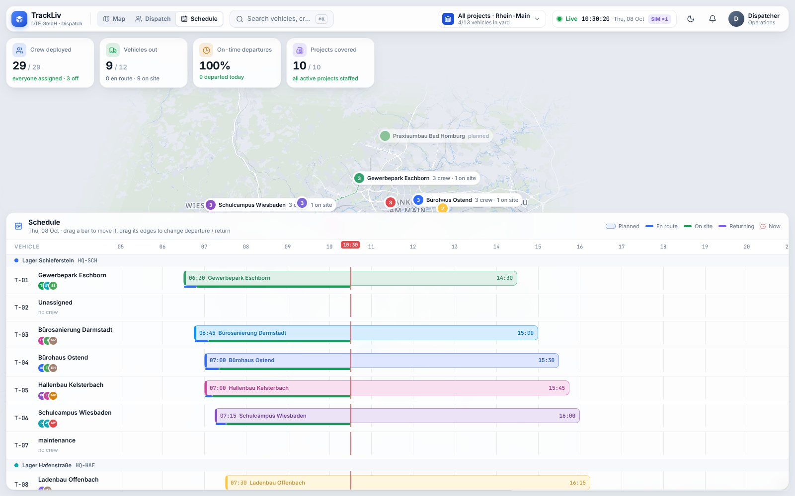
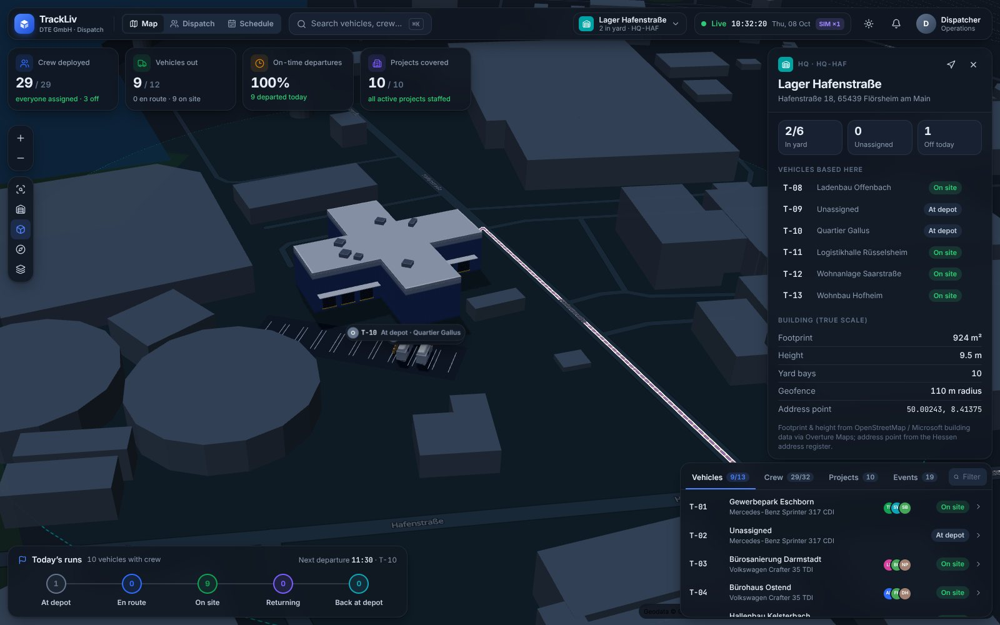

# TrackLiv

Live crew & vehicle dispatch and schedule tracking for **DTE GmbH**, Flörsheim am Main.

TrackLiv shows every project in the Rhein-Main region on one map. All three depots, **Schieferstein 4** and **Hafenstraße 18** in Flörsheim and **Neben dem Mühlweg 20–30** in Bischofsheim, are rebuilt in 3D at true scale from their real building footprints. Vehicles come in live from **FleetGO**. Each vehicle gets a crew of 1–4 people and a destination: a project from the list, or a custom place. A **Randomize** button builds the day's plan for you, and anything you've pinned stays where it is.



| True-scale 3D HQ (Schieferstein 4) | Yard close-up (Hafenstraße 18) |
| --- | --- |
|  |  |
| **Dispatch board** | **Randomize scenario (pins are kept)** |
|  |  |
| **Schedule / Gantt** | **Dark ops mode** |
|  |  |

## Quick start

```bash
npm install
npm run dev          # API on :8787 + web on :5173
open http://localhost:5173
```

Requires Node 20+. Without FleetGO credentials it starts in **simulator mode**. The demo fleet then drives the real road network on a randomized demo plan for today. On restart the simulator replays the day so far, so positions, stages and the event log stay consistent.

Production: `npm run build && npm start` (one process on `PORT`, default 8787, which serves both the API and the built web app). In production a login is required: see [Logins](#logins).

## What you can do

**Map (default view).** A regional overview that fits all projects, with HQs, project markers (crew on site, en route) and planned road routes. Zoom into an HQ, or pick it in the HQ switcher, to fly into the **true-scale 3D model**. You'll see the real building footprint and height, loading docks, the yard with parking bays, every vehicle as a 3D model at its GPS position, and the crew standing next to their vehicle (or waiting at the muster point when nobody has assigned them yet). The panels follow the layout of an operations twin:
- **KPI cards**: crew deployed, vehicles out, on-time departures, projects covered.
- **Object panel**: Palantir-style property sheet for any vehicle, person, project or HQ, with linked objects you can pivot through.
- **Run tracking**: a stepper from *Crew ready → Departed → On site → Returning → Back at HQ*, with actual times and ETA.
- **Live list**: tabs for vehicles, crew, projects and events.

**Dispatch board** (`2`)
- Drag people onto vehicles. Each vehicle holds 1–4 people, limited by its seats.
- Click a destination to open the **project list** (search, distance, crew vs. target, priority). A custom destination can be:
  - a free label,
  - an address search,
  - a pin dropped on the map.
- **Pin** (🔒) a person, a destination, or a whole vehicle.
- **Send to a task**: tick a few people → *Send to a task & pin*. They ride together on the best free vehicle, and both crew and destination are pinned.
- **Randomize**: everyone else is grouped at random and sent to random active projects. You get a scenario preview first, as a diff, with a reproducible seed, *Reroll* and *Apply*. Rules:
  - every vehicle needs a licensed driver (B / BE / C1 / C1E / C / CE hierarchy),
  - every active project gets covered first, then the rest is spread by priority,
  - preferred crew size, and people prefer their own depot,
  - you can top up pinned crews or leave them exactly as pinned,
  - you can limit it to one depot.

  Vehicles already on the road are never touched.
- Plan **tomorrow** or any other day, or *Copy today*. Undo/redo with `⌘Z` / `⌘⇧Z`. Every change is written to the audit log with your name.

**Schedule** (`3`): a Gantt chart of departures and returns per vehicle, with the actual en-route, on-site and returning times from GPS and a live "now" line. Drag a bar to move a run, or drag its edges to change the times.

**Data** (`4`): this is where your real data goes in.
- **Projects**: name, client, address (address search or a pin on the map), status, priority, crew needed, colour, dates.
- **Crew**: role, driving licences, home depot, status (sick, vacation and training people are never randomized), phone.
- **Vehicles**: call sign, plate, type, 1–4 seats, licence class, home depot, FleetGO id.

Changes go live on every open screen. To start without the demo data, run `TRACKLIV_SEED=empty` on a fresh install.

**Tracking.** A geofence state machine moves each run through its stages automatically from the GPS positions:
- *departed* when the vehicle leaves its HQ (110 m geofence),
- *on site* within 250 m of the destination,
- *returning* once it is 450 m away again,
- *back at depot*.

It raises alerts when a crewed vehicle hasn't left 15 minutes after its planned time, or leaves without an assignment.

**Vehicle history** (*History* tab of a vehicle, like FleetGO's trip list): where the vehicle was on any day of the last 120 days.
- The day's **stops** (3 minutes or longer), named after the HQ or project they were at, otherwise the address FleetGO reported, with arrival, departure and duration.
- The **trips** between them, with times, kilometres and top speed, and totals for the day.
- The track is drawn on the map with numbered stops and driving-direction arrows. Hover a trip to highlight it, click it or a stop to zoom there.

TrackLiv records this itself from every position it receives (FleetGO every 30 s, or the simulator), thinned out to what the route needs, in `data/history/<day>.json.gz`.

Also: German and English (one-click **DE/EN** switch in the top bar; German is the default for German browsers), a command palette (`⌘K`), dark "ops" mode, and live multi-user updates over SSE (several dispatchers can work at once, with optimistic updates and conflict retry). The map shows all of Germany with street names (vector tiles from [OpenFreeMap](https://openfreemap.org), no API key; any OpenMapTiles-schema source can be set with `VITE_BASEMAP_URL`). Without internet it falls back to the built-in offline Rhein-Main map.

| Key | Action |
| --- | --- |
| `⌘K` / `/` | Search & commands |
| `1` `2` `3` `4` | Map / Dispatch / Schedule / Data |
| `R` | Randomize (preview) |
| `F` | Fit all projects |
| `⌘Z` / `⌘⇧Z` | Undo / redo |
| `Esc` | Close / deselect / cancel |

## FleetGO

TrackLiv signs in to the **FleetGO web dashboard** with a normal FleetGO user, in the same way you sign in on app.fleetgo.com. No API keys are needed. Put the login into `.env` (on the server: `/opt/trackliv/.env`):

```
FLEETGO_USERNAME=dispo@example.de
FLEETGO_PASSWORD=…
```

How it works:

- A headless Chromium on the server opens app.fleetgo.com and signs in on FleetGO's sign-in page (Keycloak, login.fleetgo.com).
- It lets the dashboard load and finds the vehicle list among the data the dashboard requests. It recognises the list by its content (number plate, position, speed, ignition), not by fixed field names, so places, geofences and trip histories are not mistaken for vehicles.
- Every `FLEETGO_POLL_SECONDS` (30 s) it repeats that request from inside the signed-in page, so FleetGO's own cookies and tokens are used.
- When the session expires it signs in again. After a rejected password it waits 15 minutes, so the FleetGO user doesn't get locked.
- Nothing secret is written to the log: no password, cookies or tokens.

`./deploy.sh --fleetgo-check` signs in once and prints what TrackLiv sees: the requests the dashboard made (structure only, no values) and the vehicles it found. FleetGO opens on each user's own start page (e.g. *Fahrten Übersicht*). If that page loads no vehicle positions, TrackLiv looks through FleetGO's menu, opens the entries that look like a live map or vehicle list (never sign-out, settings or reports) and remembers the page that has them (`data/fleetgo-page.json`). If it can't find it, the check lists the menu; set `FLEETGO_DASHBOARD_PAGE` to the right path from that list. FleetGO's map (*Karte*) gets the positions from live streams that stay open; TrackLiv reads them as they arrive and keeps each vehicle up to date from the partial updates.

Tips:

- Use a separate FleetGO user for TrackLiv, without two-factor sign-in.
- If the password contains a `$`, put it in single quotes: `FLEETGO_PASSWORD='pa$$word'`.

**Matching:**

- FleetGO vehicles are matched to TrackLiv vehicles by FleetGO id, or by licence plate (`MTK TE 800` = `MTK-TE 800`).
- Unknown vehicles are **imported automatically** (`FLEETGO_AUTO_IMPORT`).
- In live mode the simulator is off, and stages come from real GPS.

**Official API (alternative):** if you have FleetGO partner API keys, set `FLEETGO_CLIENT_ID` and `FLEETGO_CLIENT_SECRET` as well, and TrackLiv uses `POST /api/session/login` and `GET /api/equipment/Getfleet` instead of the dashboard.

**Tests:** `npm run test:fleetgo` runs the dashboard connection in a real headless Chromium against a stand-in FleetGO (`scripts/fleetgo-mock.mjs`). The stand-in is built like the real one: sign-in on a separate host, a generic query endpoint with session cookie and anti-forgery token, places mixed in with vehicles, and expiring sessions. `-- --real` additionally checks that the real sign-in page still has the expected fields, without signing in.

## Data

- **Master data, plans and the audit log** live in `apps/server/var/db.json` (on the server: `/opt/trackliv/data/db.json`).
- **Vehicle history** lives in `data/history/YYYY-MM-DD.json.gz` (one file per day, kept for 120 days).
- On first start, `TRACKLIV_SEED=demo` fills it with starting data:
  - DTE's 13 vehicles and 8 drivers, as listed in FleetGO. The plates match FleetGO, so live data links up by number plate. Make/model, seats and home depot are placeholders to edit in **Data**.
  - Example projects on real Rhein-Main streets (no house numbers). The project names and clients are fictional.
- To start over with the starting data on the server, run `./deploy.sh --reset-data` (the old data is kept in `data/backups/`). `TRACKLIV_SEED=empty` starts with no data at all.
- **Geodata** (`data/geo/`) is generated from [Overture Maps](https://overturemaps.org) (release 2026-09-23):
  - `hq-*.geojson`: every building with height, streets, rail, yards and water within about 1 km of both HQs.
  - `region-*.geojson`: an offline Rhein-Main basemap (towns, motorways, primary and secondary roads, rail, rivers, forest and urban areas). No tile server or API key is needed.
  - `road-graph.json.gz`: a routable road graph for ETAs, planned routes and the simulator – every street in Rhein-Main plus the motorways, federal and main roads of all of Germany (~600k junctions, so projects in Ludwigshafen, Munich or Hamburg get real routes and driving times).
  - `sites.json`: HQ address points, building footprints, yard bays and gates. You can hand-edit yard bays here.

  The address points come from the official Hessen address register, through Overture and OpenAddresses. Regenerate with:

  ```bash
  pip install pyarrow shapely
  python3 scripts/geo/fetch_overture.py   # reads only the needed parquet row groups from S3
  python3 scripts/geo/build_geodata.py
  ```

## Deploy to trackliv.dd-gruppe.de

TrackLiv runs on our own server, next to Registra Atlas. It is one Docker container (`trackliv-app`), and the Caddy that already serves atlas.dd-gruppe.de also serves trackliv.dd-gruppe.de, with automatic TLS. A static host such as Netlify is not an option: the FleetGO poller, the simulator and the live stream (SSE) need a long-running server, and the plans are stored on disk.

```bash
./deploy.sh              # upload, build on the server (tests + type check run inside the build), start
./deploy.sh --no-build   # upload + restart with the image already on the server (e.g. after editing .env)
./deploy.sh --status     # container, health and the last log lines
./deploy.sh --logs       # follow the log
./deploy.sh --dry-run    # show what would be uploaded
./deploy.sh --fleetgo-check   # sign in to FleetGO once and show what TrackLiv sees
```

On the first run the script asks for the SSH login and port (the same as for Registra Atlas) and whether a login is required, and saves the answers in `deploy/server.env`. That file is git-ignored.

**Once, before the first deploy:**

1. **DNS:** add an A record `trackliv.dd-gruppe.de` pointing to the server (check with `dig +short trackliv.dd-gruppe.de`).
2. **Caddy:** Registra Atlas' Caddy has to load extra sites from `/opt/registra-atlas/deploy/sites/`. Apply [`deploy/registra-atlas-edge.patch`](deploy/registra-atlas-edge.patch) in the Registra Atlas repo (`git apply …/trackliv/deploy/registra-atlas-edge.patch`) and run its `./deploy.sh` once. The patch adds one `import` line to both Caddyfiles and mounts the `sites` folder; Atlas' own routing stays as it is. Until then `./deploy.sh` here still starts TrackLiv, but tells you the domain is not routed yet.

**What lives on the server (`/opt/trackliv`):**

| Path | What |
| --- | --- |
| `app/` | the uploaded source (replaced on every deploy) |
| `.env` | settings and secrets (chmod 600, never uploaded). Created from `.env.example` on the first deploy, with a generated `TRACKLIV_SESSION_SECRET`. Every deploy updates the Atlas sign-in values (`ATLAS_*`) and leaves everything else as it is. |
| `data/sessions.json` | who is signed in (Atlas refresh tokens encrypted with the session secret) |
| `data/db.json` | master data, plans and the audit log |
| `data/backups/` | a daily copy (kept 30 days) and one before every deploy (last 20) |

To switch from the simulator to live vehicles, put the FleetGO login (`FLEETGO_USERNAME`, `FLEETGO_PASSWORD`) into `/opt/trackliv/.env`, run `./deploy.sh --no-build`, then `./deploy.sh --fleetgo-check`.

### Logins: Registra Atlas accounts

People sign in to TrackLiv with their **Registra Atlas account**: the same e-mail and password as on atlas.dd-gruppe.de, from Atlas' own user database. TrackLiv stores no passwords. It asks Atlas the same way the Atlas web app does:
- first Atlas' Konto-Dienst, over the internal Docker network `atlas-konto`;
- then Atlas' Supabase, but only if the Konto-Dienst does not answer. A wrong password never falls back.

How it works:
- **Settings:** every deploy copies just the needed values (`KONTO_ANON_KEY`, `KONTO_PRIMAER`, `SUPABASE_URL`) from `/opt/registra-atlas/.env` into TrackLiv's `.env` (`ATLAS_*`). Atlas' service keys and database passwords are never copied. The public Supabase key for the fallback comes from the Atlas project folder on your computer (`ATLAS_DIR` in `deploy/server.env`, default `~/Documents/GitHub/registra-atlas`).
- **Who gets in:** Atlas administrators, and everyone with the **TrackLiv** permission in Atlas (Verwaltung → Benutzer → the person → "TrackLiv"). `ACCESS` in `deploy/server.env` can widen that:
  - `admins` (the default): nobody extra,
  - `all`: every active Atlas account,
  - or e-mails: `ACCESS="admins,dispo@dd-gruppe.de,lager@dd-gruppe.de"`.
- **From Atlas' menu:** people with access see "TrackLiv" in Atlas' menu. It opens TrackLiv in a new tab, already signed in to their own account: Atlas issues a one-time ticket (valid 60 seconds, usable once) and TrackLiv redeems it with Atlas server to server. These sessions are re-checked with Atlas like the others.
- **Staying in sync with Atlas:** TrackLiv checks each session with Atlas every 5 minutes. Someone who is locked or deactivated in Atlas, or removed from `ACCESS`, is signed out of TrackLiv too, and their open screen returns to the sign-in page.
- **Passwords and lockouts:** a forgotten password is reset in Atlas. Atlas' lockout after failed attempts applies here as well.
- **Signing out:** signing out of TrackLiv ends only the TrackLiv session; Atlas stays signed in.
- **Sessions:** TrackLiv's own sessions last 30 days of use and survive deploys (`data/sessions.json`, refresh tokens encrypted).
- **Audit log:** every change is attributed to the person's Atlas name.

### Machines and equipment from Atlas' Inventar

The vehicle panel and the project panel have a section **Equipment & material** ("Geräte & Material"). "Add from the Atlas inventory" lists the articles of the Atlas inventories (Bestände) the signed-in person may see in Atlas; sales stock is left out. Picking one:

- puts it on the vehicle, or leaves it at the project;
- marks it **"In Benutzung"** in Atlas, with the location "TrackLiv: TE 710 · MTK TE 710" and who did it (an article from a rental stock keeps its status);
- shows a small badge on the vehicle's dispatch card.

From the vehicle, "Leave at <project>" moves it to the vehicle's project; "Back to stock" makes it available in Atlas again, with its old status and location. Atlas records every step in the article's history. The office invoices the article in Atlas as before, and can take it back to stock there too.

Atlas checks every change against the signed-in person, so this needs the Atlas sign-in. It also needs the shared key `TRACKLIV_SCHLUESSEL`, which Atlas' `./deploy.sh` generates; TrackLiv's deploy copies it as `ATLAS_TRACKLIV_KEY` and sets `ATLAS_API_URL=http://registra-review-api:3000`. Atlas' Caddy blocks these internal routes from outside. `node scripts/e2e-atlas.mjs` tests the sign-in from Atlas and the inventory against a stand-in for Atlas (`scripts/atlas-mock.mjs`).

To run without a login (e.g. as a demo), set `LOGIN="off"` in `deploy/server.env` and deploy; `LOGIN="on"` switches it back on.

On a server without Registra Atlas, TrackLiv falls back to its own list: `TRACKLIV_USERS=Admin:…,Dispo 2:another-password` in the server `.env`. The deploy creates an `Admin` login and prints its password once. Passwords can be plain or a scrypt hash from `npm run hash-password`; don't use `$` or `,` in plain passwords.

## Architecture

```
packages/core   Shared TypeScript domain: types, assignment rules, randomizer, geofence stages,
                road-graph routing (A*). Unit-tested with Vitest.
apps/server     Node + Express API: JSON store, FleetGO client & poller, simulator, SSE hub,
                geodata serving (pre-gzipped), Nominatim proxy for address search.
apps/web        React 19 + Vite + Tailwind 4. MapLibre GL renders the offline basemap and 3D
                buildings; a three.js custom layer renders the HQ models, vehicles and crews.
scripts/geo     Overture extraction pipeline (Python).
```

- `npm test`: unit tests for the assignment rules, the randomizer (fuzzed over 300 seeds), geofence stages, routing and FleetGO parsing.
- `npm run e2e`: builds the app, starts a throw-away production server and drives the real UI in headless Chromium:
  - sign-in, sign-out and the security headers (CSP violations fail the run),
  - drag & drop,
  - the destination picker and custom destinations,
  - send-to-task & pin,
  - randomize and undo,
  - schedule drag,
  - creating a project with a map pin,
  - map selection and the command palette.
- `npm run typecheck`: checks all packages.
- `npm run screenshot -- out.png`: captures the running app.

## Licences & attribution

The map data is © OpenStreetMap contributors (ODbL) and Microsoft building footprints (ODbL), via the Overture Maps Foundation. The address points come from the Hessen address register (DL-DE-ZERO-2.0). Map label glyphs use Noto Sans (SIL OFL, see `apps/web/public/fonts/OFL.txt`).
